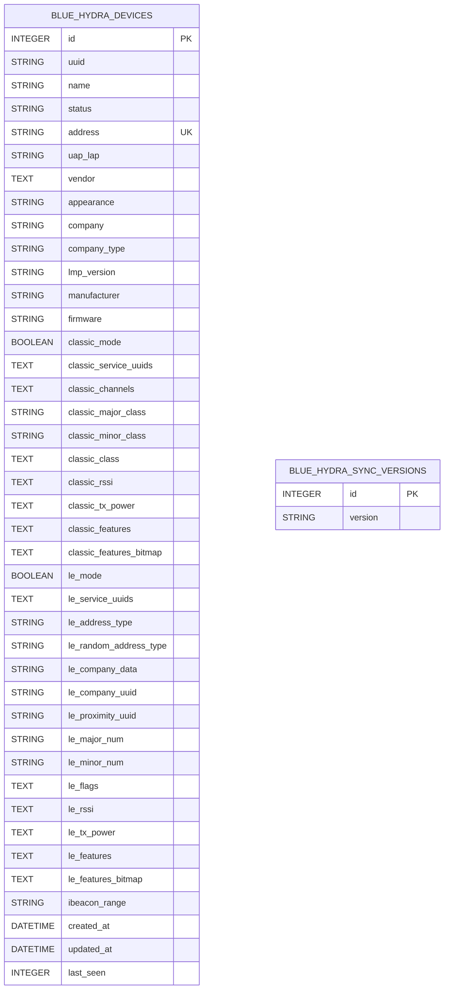

# Blue Hydra Database ER Diagram

## Entity Relationship Diagram

## Table Descriptions

### blue_hydra_devices
The main table storing all discovered Bluetooth devices.

**Key Columns:**
- `id`: Primary key, auto-incrementing
- `address`: MAC address of the device (should be unique but not enforced in schema)
- `uuid`: Sync ID for external synchronization
- `uap_lap`: Last 4 octets of MAC for device lookup
- `status`: Device status (online/offline)
- `last_seen`: Unix timestamp of last detection

**Mode Indicators:**
- `classic_mode`: Boolean indicating Classic Bluetooth support
- `le_mode`: Boolean indicating Bluetooth Low Energy support

**JSON Storage Columns:**
These columns store JSON arrays or objects as text:
- `*_rssi`: Arrays of RSSI readings (limited to 100 values)
- `*_service_uuids`: Arrays of service UUIDs
- `*_features`: Arrays of feature descriptions
- `*_features_bitmap`: JSON objects with page/bitmap pairs

### blue_hydra_sync_versions
Tracks synchronization versions for external systems.

**Key Columns:**
- `id`: Primary key
- `version`: UUID string for version tracking

## Relationships

Currently, Blue Hydra uses a single-table design with no foreign key relationships. All device data is denormalized into the `blue_hydra_devices` table.

## Indexes

**Implicit Indexes:**
- Primary key index on `id` column

**Recommended Indexes (not in current schema):**
- Index on `address` for device lookup
- Index on `uap_lap` for partial MAC lookup
- Index on `status` for filtering active devices
- Composite index on `(status, last_seen)` for timeout queries

## Data Patterns

### Device Identification
Devices can be identified by multiple methods:
1. Full MAC address
2. UAP/LAP (partial MAC)
3. iBeacon trinity (proximity UUID + major + minor)
4. Gimbal beacons (company + company data)

### Temporal Data
- `created_at`: When device was first discovered
- `updated_at`: Last modification time
- `last_seen`: Unix timestamp for timeout calculations

### Mode Detection
A device can support:
- Classic only (`classic_mode=true, le_mode=false`)
- LE only (`classic_mode=false, le_mode=true`)
- Dual mode (`classic_mode=true, le_mode=true`)
- Unknown (both false - legacy data) 